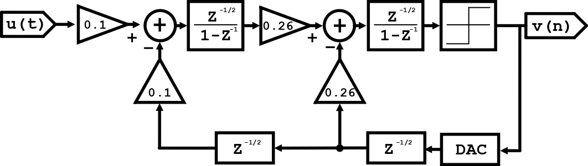
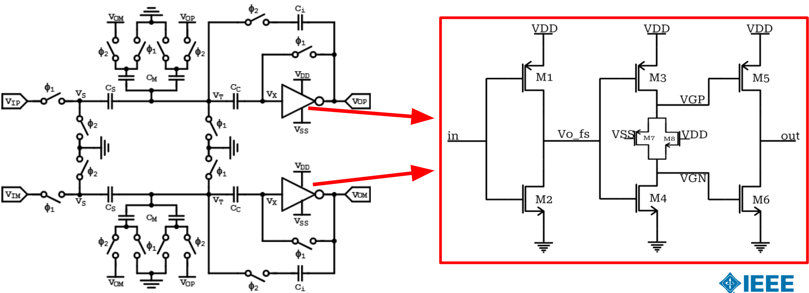

# A Ring-Amplifier Based Delta-Sigma Modulator (A24 OnchipDS)

This work presents a low-power, Ring-Amplifier-based Delta-Sigma ($\Delta\Sigma$) modulator, which serves as the core architectural block of a high-performance $\Delta\Sigma$ Analog-to-Digital Converter (ADC). The innovation lies in leveraging a modified Ring Oscillator configuration to implement a low-voltage, high-speed amplifier. While Ring Amplifiers have predominantly been deployed in Pipeline ADCs, their exceptionally low-voltage operating characteristics make them well-suited to power-efficient $\Delta\Sigma$ topologies. This modulator is designed specifically for audio applications, where high resolution, superior linearity, ultra-low power consumption, and a bandwidth (BW) of at least 20 kHz are the primary design specifications.

---

## Modulator Architecture

This project implements a second-order, discrete-time $\Delta\Sigma$ modulator. The discrete-time loop filter is built using switched-capacitor (SC) circuits powered by a fully differential ring amplifier. 

### Modulator Block Diagram

Below is the initial proposed discrete-time implementation block diagram of the second-order $\Delta\Sigma$ modulator showing the loop filter coefficients (0.1 and 0.26) and the feedback loops. Note that these coefficients may be adjusted during the development and verification phases in order to optimize system linearity.



---

## Design Highlights

1. **Switched-Capacitor Loop Filter**: By replacing standard Operational Transconductance Amplifiers (OTAs) with dynamic ring amplifiers, the loop filter achieves robust heavy-load driving capabilities and an open-loop gain exceeding $60\text{ dB}$.
2. **Extreme Supply Voltage Scaling**: The supply voltage can be significantly scaled down—potentially close to the sum of the PMOS and NMOS threshold voltages ($V_{th,p} + V_{th,n}$)—without compromising speed or gain at audio bandwidths.
3. **Dynamic Power Efficiency**: Due to its inverter-like dynamic operation, the ring amplifier automatically enters an efficient power-down/tri-state state once the charge transfer/integration phase concludes, saving static power.
4. **Ring Amplifier & Switched-Capacitor Integrator**:



---

## Pin Requirements

The table below lists the pin requirements for this Delta-Sigma modulator:

| Number | Name | Type | Direction |
| :---: | :--- | :--- | :--- |
| 1 | VSS | Ground | Bidirectional |
| 2 | VDD | 3V Power | Bidirectional |
| 3 | VINP | Analog | Input |
| 4 | VINN | Analog | Input |
| 5 | VCM | Analog | Bidirectional |
| 6 | CLK | Digital | Input |
| 7 | RESET | Digital | Input |
| 8 | YOUT | Digital | Output |

---

## Repository Structure

```text
designs/
└── DS_modulator/
    ├── clkgen/                  # Non-overlapping clock generator
    ├── comparator/              # Quantizer comparator block
    ├── dff/                     # D-type flip-flops for feedback loop
    ├── doubler/                 # Voltage doubler block
    ├── gate_and/                # Standard logic gate AND
    ├── gate_buf_L0d28/          # Standard buffer gate
    ├── gate_inv_L0d28/          # Standard inverter gate
    ├── gate_inv_L0d5/           # Standard inverter gate
    ├── gate_nand/               # Standard logic gate NAND
    ├── gate_or/                 # Standard logic gate OR
    ├── gate_xor/                # Standard logic gate XOR
    ├── integrator/              # Switched-capacitor integrator
    ├── ring_amp/                # Single-ended Ring Amplifier core
    ├── ring_amp_diff/           # Fully differential Ring Amplifier
    ├── std_cells_layout_utils/  # Standard cells layout utilities 
docs/
├── OnchipDS - Proposal Presentation.pdf  # Project proposal presentation slides
└── README.md                             # Repository team git workflow guide
first_setup.sh               # Shell script for initial repository setup
```

---

## Getting Started

### For Reviewers & Users

To clone and explore the design:

```bash
git clone git@github.com:AlexMantilla1/chipa2026_gf180mcu_DeltaSigma.git
cd chipa2026_gf180mcu_DeltaSigma
```

> [!IMPORTANT]
> Always open **xschem** inside the `designs/` directory to ensure library references resolve correctly.

### For Project Contributors

If you are a contributor working on a sub-block, run the setup script to configure local git settings, install pre-commit hooks, and switch to your assigned block branch:

```bash
./first_setup.sh
```

For detailed collaboration rules and branch management, refer to the [Git Workflow Guide](docs/README.md).

---

## Team & Affiliation

**Team OnchipDS**
Affiliated with the **Onchip Research Group** from the **Universidad Industrial de Santander (UIS)**, Colombia.

### Core Team
* **AlexM** - Team Lead (MSc Student)
* **RicardoV** - Team Member (MSc Student)
* *With the support of occasional contributors.*

---

## Links

* **Repository**: [GitHub Link](https://github.com/AlexMantilla1/chipa2026_gf180mcu_DeltaSigma)
* **Git Workflow Guide**: [docs/README.md](docs/README.md)
* **Project Proposal**: [docs/OnchipDS - Proposal Presentation.pdf](docs/OnchipDS%20-%20Proposal%20Presentation.pdf)
* **Pin Requirements**: [Google Sheets Link](https://docs.google.com/spreadsheets/d/1fApMbtZSiq5V2GvFwdgLzX3I5TPhH-cjsxK9vVr4s4A/edit?usp=sharing)

---

## References

[1] Y. Chae and G. Han, "Low Voltage, Low Power, Inverter-Based Switched-Capacitor Delta-Sigma Modulator," in *IEEE Journal of Solid-State Circuits*, vol. 44, no. 2, pp. 458-472, Feb. 2009, doi: [10.1109/JSSC.2008.2010973](https://doi.org/10.1109/JSSC.2008.2010973).

[2] J. Lagos, B. P. Hershberg, E. Martens, P. Wambacq and J. Craninckx, "A 1-GS/s, 12-b, Single-Channel Pipelined ADC With Dead-Zone-Degenerated Ring Amplifiers," in *IEEE Journal of Solid-State Circuits*, vol. 54, no. 3, pp. 646-658, March 2019, doi: [10.1109/JSSC.2018.2889680](https://doi.org/10.1109/JSSC.2018.2889680).
