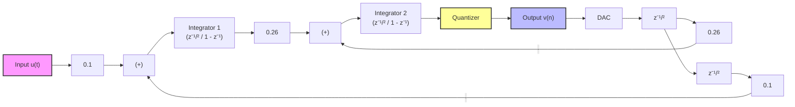
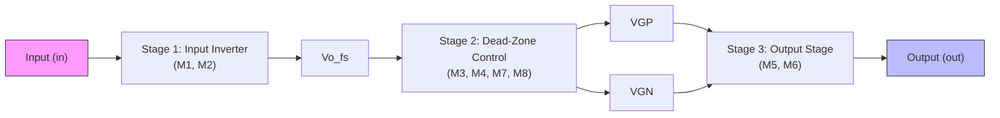

# A Ring-Amplifier Based Delta-Sigma Modulator (A24 OnchipDS)

This work presents a low-power, Ring-Amplifier-based Delta-Sigma ($\Delta\Sigma$) modulator, which serves as the core architectural block of a high-performance $\Delta\Sigma$ Analog-to-Digital Converter (ADC). The innovation lies in leveraging a modified Ring Oscillator configuration to implement a low-voltage, high-speed amplifier. While Ring Amplifiers have predominantly been deployed in Pipeline ADCs, their exceptionally low-voltage operating characteristics make them well-suited to power-efficient $\Delta\Sigma$ topologies. This modulator is designed specifically for audio applications, where high resolution, superior linearity, ultra-low power consumption, and a bandwidth (BW) of at least 20 kHz are the primary design specifications.

---

## Modulator Architecture

This project implements a second-order, discrete-time $\Delta\Sigma$ modulator. The discrete-time loop filter is built using switched-capacitor (SC) circuits powered by a fully differential ring amplifier. 

### Modulator Block Diagram

Below is the discrete-time implementation block diagram of the second-order $\Delta\Sigma$ modulator showing the loop filter coefficients (0.1 and 0.26) and the feedback loops:



> [!NOTE]
> *Placeholder for the modulator block diagram image:*
> 

---

## Design Highlights

1. **Switched-Capacitor Loop Filter**: By replacing standard Operational Transconductance Amplifiers (OTAs) with dynamic ring amplifiers, the loop filter achieves robust heavy-load driving capabilities and an open-loop gain exceeding $60\text{ dB}$.
2. **Extreme Supply Voltage Scaling**: The supply voltage can be significantly scaled down—potentially close to the sum of the PMOS and NMOS threshold voltages ($V_{th,p} + V_{th,n}$)—without compromising speed or gain at audio bandwidths.
3. **Dynamic Power Efficiency**: Due to its inverter-like dynamic operation, the ring amplifier automatically enters an efficient power-down/tri-state state once the charge transfer/integration phase concludes, saving static power.
4. **Ring Amplifier Architecture**:
   * **Stage 1**: Fast, high-gain input inverter.
   * **Stage 2**: Inverter stage with dead-zone configuration (via a transmission gate for bias control VGP/VGN) to degenerate the dead-zone and stabilize the system.
   * **Stage 3**: Output charging inverter stage capable of driving heavy capacitive loads with a rail-to-rail swing.



> [!NOTE]
> *Placeholder for the Ring Amplifier schematic image:*
> 

---

## Repository Structure

```text
designs/
└── DS_modulator/
    ├── clkgen/                  # Non-overlapping clock generator
    ├── comparator/              # Quantizer comparator block
    ├── dff/                     # D-type flip-flops for feedback loop
    ├── doubler/                 # Voltage doubler block
    ├── gate_and/                # Standard logic gate AND
    ├── gate_buf_L0d28/          # Standard buffer gate
    ├── gate_inv_L0d28/          # Standard inverter gate
    ├── gate_inv_L0d5/           # Standard inverter gate
    ├── gate_nand/               # Standard logic gate NAND
    ├── gate_or/                 # Standard logic gate OR
    ├── gate_xor/                # Standard logic gate XOR
    ├── integrator/              # Switched-capacitor integrator
    ├── ring_amp/                # Single-ended Ring Amplifier core
    ├── ring_amp_diff/           # Fully differential Ring Amplifier
    ├── std_cells_layout_utils/  # Standard cells layout utilities
    └── testing/                 # Testbenches and simulation files
docs/
├── OnchipDS - Proposal Presentation.pdf  # Project proposal presentation slides
└── README.md                             # Repository team git workflow guide
first_setup.sh               # Shell script for initial repository setup
```

---

## Getting Started

Clone the repository and run the setup script:

```bash
git clone git@github.com:AlexMantilla1/chipa2026_gf180mcu_DeltaSigma.git
cd chipa2026_gf180mcu_DeltaSigma
./first_setup.sh
```

> [!IMPORTANT]
> Always open **xschem** inside the repository root directory to ensure library references resolve correctly.

---

## Team & Affiliation

**Team OnchipDS**
Affiliated with the **Onchip Research Group** from the **Universidad Industrial de Santander (UIS)**, Colombia.

### Core Team
* **AlexM** - Team Lead (MSc Student)
* **RicardoV** - Team Member (MSc Student)
* *With the support of occasional contributors.*

---

## Links

* **Repository**: [GitHub Link](https://github.com/AlexMantilla1/chipa2026_gf180mcu_DeltaSigma)
* **Git Workflow Guide**: [docs/README.md](docs/README.md)
* **Project Proposal**: [docs/OnchipDS - Proposal Presentation.pdf](docs/OnchipDS%20-%20Proposal%20Presentation.pdf)

---

## References

[1] Y. Chae and G. Han, "Low Voltage, Low Power, Inverter-Based Switched-Capacitor Delta-Sigma Modulator," in *IEEE Journal of Solid-State Circuits*, vol. 44, no. 2, pp. 458-472, Feb. 2009, doi: [10.1109/JSSC.2008.2010973](https://doi.org/10.1109/JSSC.2008.2010973).

[2] J. Lagos, B. P. Hershberg, E. Martens, P. Wambacq and J. Craninckx, "A 1-GS/s, 12-b, Single-Channel Pipelined ADC With Dead-Zone-Degenerated Ring Amplifiers," in *IEEE Journal of Solid-State Circuits*, vol. 54, no. 3, pp. 646-658, March 2019, doi: [10.1109/JSSC.2018.2889680](https://doi.org/10.1109/JSSC.2018.2889680).
