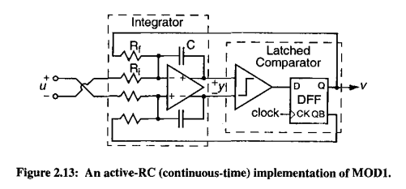
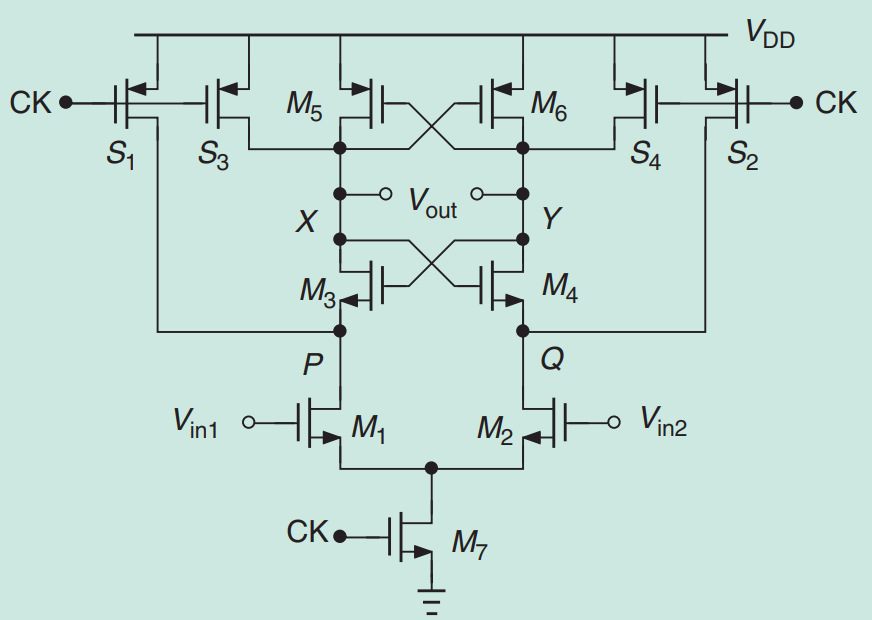

# Comparator — Clocked Dynamic Comparator

## General Description:

A comparator is a circuit that receives two analog input voltages and produces a digital output indicating which of the two is greater. 
Unlike a continuous-time amplifier, a clocked dynamic comparator does not draw static current from the power supply. 
Instead, it operates in two alternating phases controlled by an external clock signal:

Reset phase (CLK = 0): Internal nodes are precharged to a known state, and the output is held at a defined level. No comparison takes place.
Regeneration phase (CLK = 1): The circuit is released, and a positive-feedback latch exponentially amplifies the small differential input voltage until the output resolves to a full digital level (VDD or GND).

This regenerative behavior makes dynamic comparators significantly more power-efficient than their static counterparts, as energy is consumed only during the brief regeneration window rather than continuously. 
The decision speed depends on the magnitude of the differential input voltage: a larger overdrive results in a shorter regeneration time and, consequently, a lower propagation delay.

The comparator implemented here is designed to operate using the GF180MCU 180 nm CMOS process, with a nominal supply voltage of 1.5 V and a clock frequency in the 4–5 MHz range, 
matching the oversampling frequency of the Delta-Sigma modulator system.

## Role in the Delta-Sigma Modulator:

A Delta-Sigma Modulator (DSM) is a mixed-signal system that converts an analog input signal into a high-speed digital bitstream.
It achieves this by oversampling the input at a frequency much higher than the Nyquist frequency and shaping the quantization noise so that it falls outside the band of interest, where it can be removed by a digital decimation filter.

The comparator acts as the 1-bit quantizer at the core of the modulator loop. In each clock cycle, a decision is made as to whether the output of the loop filter (a chain of integrators) is above or below a reference level,
producing a "1" or a "0". This binary decision is fed back via a 1-bit DAC to the input summing node, closing the feedback loop that drives the quantization error toward zero over time.

# Comparator schematic

The quality of the modulator depends critically on the comparator meeting two requirements:

Speed: The comparator must resolve its decision in less than half a clock period (< 100 ns at 5 MHz) so that the feedback DAC can settle before the next cycle.
Low offset: The input-referred offset voltage adds directly to the modulator's in-band noise floor. 
Although first-order noise shaping attenuates much of the quantization noise, a large offset shifts the effective threshold and degrades linearity.

The clocked dynamic architecture is the natural choice here because the DSM already provides a clock, the power budget for an integrated analog design is limited,
and the regenerative gain of the latch is far superior to what an open-loop static comparator can achieve within the same time window.

Reference: [Delta-Sigma Modulator Design Example](https://d1.amobbs.com/bbs_upload782111/files_17/ourdev_464768.pdf)

## Analysis

The first identified cause preventing the correct operation of the circuit is insufficient gain, attributed primarily to inadequate sizing of the input differential pair. This limitation is further compounded by the lack of proper sizing of both the PMOS and NMOS latches, which compromises the overall performance of the comparator block. Additionally, the switches present in the design have not been optimized in terms of their geometric parameters; since a larger channel width (W) combined with a minimum channel length (L) results in faster switching, keeping them at the standard dimensions provided by the PDK represents a significant constraint on the correct operation of the circuit.

# Dynamic Latch Comparator

B. Razavi, "The StrongARM Latch: A Circuit for All Seasons," *IEEE Solid-State Circuits Magazine*, pp. 12–17, Spring 2015. doi: 10.1109/MSSC.2015.2418155.

**Key properties:**
1. No static power consumption
2. Rail-to-rail output
3. Its input-referred offset comes from a single differential pair

**Topology:**
- 4 switches → S₁, S₂, S₃, and S₄
- 2 coupled pairs → M₃–M₄ and M₅–M₆

---

## Phase (1): Pre-charge

- CK is at a low level; M₁ and M₂ are off.
- Common nodes P, Q, X, and Y are **pre-charged to V_DD**.

---

## Phase (2): Amplification

- When CK goes high, switches S₁–S₄ turn off.
- M₁ and M₂ turn on.
- A differential current proportional to V_in1 − V_in2 is generated.

Initially, M₃–M₆ remain off. This current discharges capacitors C_P and C_Q, so V_P − V_Q increases.

The tail current is approximately constant.

$$
V_P - V_Q \approx \left(\frac{g_{m1,2}}{C_P}\right)(V_{in1} - V_{in2})\, t
$$

where $C_P = C_Q$.

---

## Phase (3): Turn-on of the Cross-Coupled NMOS Pair

V_P and V_Q decrease until reaching $V_{DD} - V_{THN}$, at which point M₃–M₄ begin to conduct.

The amplification time is given by:

$$
t_{amp} = \frac{C_P V_{THN}}{I_{CM}}
$$

where $I_{CM}$ is the common-mode current of each capacitance.

The voltage gain in this stage is:

$$
A_v = \frac{g_{m1,2}\, V_{THN}}{I_{CM}}
$$

$+\Delta I$ and $-\Delta I$ are the differential pair currents. These currents produce an unequal discharge of the X and Y nodes, driving one node toward V_DD and the other toward GND.

This represents a natural response of the form:

$$
e^{-t/\tau_{reg}}
$$

where $\tau_{reg}$ is the regeneration time constant:

$$
\tau_{reg} = \frac{C_{XY}}{g_{m3,4}\left(1 - \dfrac{C_{PQ}}{C_{XY}}\right)}
$$

---

## Phase (4): Positive Feedback (PMOS Latch)

The output voltages V_X and V_Y decrease until reaching $V_{DD} - V_{THP}$; at that point M₅ and M₆ conduct, entering Phase (4).

- **Positive feedback** builds up around transistors M₅ and M₆: one output goes to V_DD and the other to GND.
- **M₃ and M₄** eliminate the continuous (static) current path between V_DD and GND → *eliminates static current*.
- **M₅ and M₆** restore the output high level up to V_DD.
- **S₁ and S₂** pre-charge nodes X and Y to V_DD, ensuring M₅ and M₆ remain off during the initial amplification stage.
- **S₃ and S₄** pre-charge the P and Q nodes, reducing the dynamic offset.

---

## Power Consumption

$$
P = f_{CK}\left(2C_{PQ} + C_{XY}\right)V_{DD}^2
$$

## Specs

Specs to comparator

| Especificación | Símbolo | Min (Target) | Typ (Target) | Max (Target) | Min (SCH) | Typ (SCH) | Max (SCH) | Min (Layout) | Typ (Layout) | Max (Layout) | Unidad |
|---|---|---|---|---|---|---|---|---|---|---|---|
| Tensión de alimentación | VDD | 1.35 | 1.5 | 1.65 | 1.35 | 1.5 | 1.65 | 1.35 | 1.5 | 1.65 | V |
| Frecuencia de reloj | f_CLK | 4 | 5 | TBS | 4 | 5 | TBS | 4 | 5 | TBS | MHz |
| Retardo de propagación | t_PD | | 50 | 100 | TBS | 40 | 90 | TBS | 55 | 110 | ns |
| Tensión de offset en entrada | V_OS | TBS | 5 | 20 | TBS | 8 | 25 | TBS | 10 | 30 | mV |
| Rango de modo común en entrada | V_CM | 0.3 | 0.75 | 1.2 | 0.3 | 0.75 | 1.2 | 0.35 | 0.75 | 1.15 | V |
| Overdrive mínimo de entrada | V_OD | TBS | 10 | TBS | TBS | 8 | TBS | TBS | 12 | TBS | mV |
| Tensión de salida alta | V_OH | 1.4 | 1.5 | | 1.35 | 1.45 | | 1.3 | 1.42 | | V |
| Tensión de salida baja | V_OL | TBS | 0 | 0.1 | TBS | 0 | 0.15 | TBS | 0 | 0.2 | V |
| Consumo de potencia | P | TBS | 50 | 100 | TBS | 60 | 120 | TBS | 70 | 140 | µW |
| Tiempo de regeneración | τ | TBS | 5 | 15 | TBS | 6 | 18 | TBS | 8 | 22 | ns |
| Slew rate de salida | SR | 10 | 30 | TBS | 8 | 25 | TBS | 6 | 20 | TBS | V/µs |
| CMRR | CMRR | 35 | 50 | TBS | 30 | 45 | TBS | 28 | 42 | TBS | dB |
| PSRR | PSRR | 35 | 45 | TBS | 30 | 42 | TBS | 28 | 38 | TBS | dB |
| Margen de fase (lazo DSM) | PM | 45 | 60 | TBS | 45 | 55 | TBS | 40 | 52 | TBS | ° |
| Margen de ganancia (lazo DSM) | GM | 6 | 10 | TBS | 6 | 9 | TBS | 5 | 8 | TBS | dB |
| Temperatura de operación | T_A | -40 | 27 | 125 | -40 | 27 | 125 | -40 | 27 | 125 | °C |

Reference: [MAX49140 Ultra-Low-Power Comparator Datasheet (Analog Devices)](https://www.analog.com/media/en/technical-documentation/data-sheets/MAX49140.pdf)
