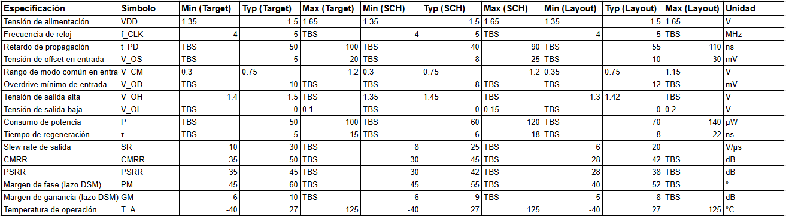

# Comparator — Clocked Dynamic Comparator

## General Description:

A comparator is a circuit that receives two analog input voltages and produces a digital output indicating which of the two is greater. 
Unlike a continuous-time amplifier, a clocked dynamic comparator does not draw static current from the power supply. 
Instead, it operates in two alternating phases controlled by an external clock signal:

Reset phase (CLK = 0): Internal nodes are precharged to a known state, and the output is held at a defined level. No comparison takes place.
Regeneration phase (CLK = 1): The circuit is released, and a positive-feedback latch exponentially amplifies the small differential input voltage until the output resolves to a full digital level (VDD or GND).

This regenerative behavior makes dynamic comparators significantly more power-efficient than their static counterparts, as energy is consumed only during the brief regeneration window rather than continuously. 
The decision speed depends on the magnitude of the differential input voltage: a larger overdrive results in a shorter regeneration time and, consequently, a lower propagation delay.

The comparator implemented here is designed to operate using the GF180MCU 180 nm CMOS process, with a nominal supply voltage of 1.5 V and a clock frequency in the 4–5 MHz range, 
matching the oversampling frequency of the Delta-Sigma modulator system.

## Role in the Delta-Sigma Modulator:

A Delta-Sigma Modulator (DSM) is a mixed-signal system that converts an analog input signal into a high-speed digital bitstream.
It achieves this by oversampling the input at a frequency much higher than the Nyquist frequency and shaping the quantization noise so that it falls outside the band of interest, where it can be removed by a digital decimation filter.

The comparator acts as the 1-bit quantizer at the core of the modulator loop. In each clock cycle, a decision is made as to whether the output of the loop filter (a chain of integrators) is above or below a reference level,
producing a "1" or a "0". This binary decision is fed back via a 1-bit DAC to the input summing node, closing the feedback loop that drives the quantization error toward zero over time.

# Comparator schematic

The quality of the modulator depends critically on the comparator meeting two requirements:

Speed: The comparator must resolve its decision in less than half a clock period (< 100 ns at 5 MHz) so that the feedback DAC can settle before the next cycle.
Low offset: The input-referred offset voltage adds directly to the modulator's in-band noise floor. 
Although first-order noise shaping attenuates much of the quantization noise, a large offset shifts the effective threshold and degrades linearity.

The clocked dynamic architecture is the natural choice here because the DSM already provides a clock, the power budget for an integrated analog design is limited,
and the regenerative gain of the latch is far superior to what an open-loop static comparator can achieve within the same time window.

Reference: R. Schreier and G. Temes, "Understanding Delta-Sigma Data Converters," IEEE Press / Wiley, 2005, Chap. 2.

## Specs

Specs to comparator

