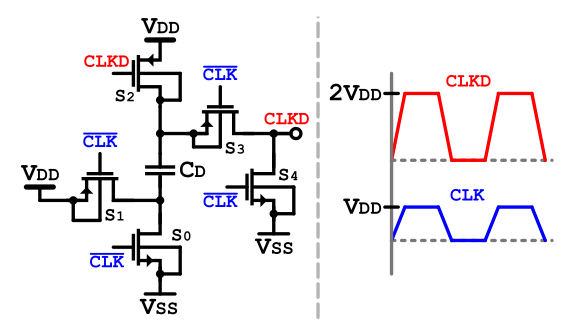

# Doubler (Clock Boosting Circuit)

*Block of the Delta-Sigma Modulator — Chipathon 2026.*

## 1. Overview

This block is a **clock voltage doubler** (clock booster). It takes the system clock CLK, which swings between 0 and $V_{DD}$, and produces a boosted clock CLKD that swings between 0 and $2 \cdot V_{DD}$, in phase with the input and at the same frequency. The doubler is built from a pump capacitor $C_D$ and five switches $S_0–S_4$. Operation alternates between two phases of CLK: in one phase the capacitor is charged to $V_{DD}$ (precharge) while the output is reset to ground; in the other phase the charged capacitor is level-shifted so that its top plate, and therefore the output, reaches the $2 \cdot V_{DD}$ level. This operation results in a doubled clock waveform which is suitable for driving the switches of the modulator.

## 2. Role in the Delta-Sigma Modulator

The modulator is a switched-capacitor (SC) circuit: its integrators sample and transfer charge through analog switches gated by the clock. At a low supply (e.g., $V_{DD}$ = 1.5 V) a switch whose gate is driven only to $V_{DD}$ has a high resistance and it cannot pass a full-swing signal. As a consequence, incomplete settling, signal-dependent charge error, and distortion degrades the modulator's linearity (SNDR) and dynamic range.

Clock boosting solves this by creating *"another voltage domain"*: the switches are actuated by a clock that reaches $2 \cdot V_{DD} $. With this boosted gate drive, simple **NMOS-only** switches turn fully on across the entire input range, giving a low, signal-independent on-resistance and rail-to-rail operation. This lets the SC integrators sample and settle correctly at low supply. The doubler therefore supplies the boosted clock CLKD that gates the critical sampling/charge-transfer switches throughout the modulator.

## 3. Short Analysis

*Figure 1. Doubler schematic: pump capacitor $C_D$ and switches S0–S4.*

The circuit is a **clock voltage doubler** built around a pump capacitor $C_D$. It maps the input clock CLK (0 → $V_{DD}$) to a boosted, in-phase clock CLKD (0 → $2 \cdot V_{DD}$) at the same frequency. Its purpose, is to create "another voltage domain" so the switched-capacitor switches can be actuated at $2 \cdot V_{DD}$ and therefore pass a full-swing signal at low $V_{DD}$. Operation is governed by the two states of CLK:

**Precharge phase — CLK = $V_{SS}$.** Switches **S0, S2, S4** are on. **S2** charges the upper plate of $C_D$ to $V_{DD}$ while **S0** holds the lower plate at $V_{SS}$, so $C_D$ is charged with its upper terminal positive:

$$V_{CD} = V_{DD}$$

At the same time **S4** forces the output to CLKD = $V_{SS}$, resetting the load.

**Boost / transfer phase — CLK = $V_{DD}$.** Switches **S1, S3** are on. **S1** drives the lower plate of $C_D$ from $V_{SS}$ up to $V_{DD}$; with the stored $V_{DD}$ across $C_D$, the upper plate is level-shifted to $2 \cdot V_{DD}$ and **S3** connects it to the output:

$$V_{CLKD} = V_{DD} + V_{CD} = 2 \cdot V_{DD}$$

**Finite-load correction.** The load capacitance $C_L$ (gate capacitance of the switches CLKD drives) absorbs part of the charge stored on $C_D$. Because S4 fully discharges CLKD each cycle, charge conservation on the boosted node gives following equation:

            
$$V_{CLKD} = \frac{2 \cdot V_{DD}}{1 + C_L / C_D}$$
            

so the fractional droop below $2 \cdot V_{DD}$ is ≈ $C_L/C_D$ for $C_D ≫ C_L$. To keep the loss small, $C_D$ must be made large compared with the load $C_L$ (e.g. $C_D \geq 100·C_L \text{for} < 1$ % droop).

## 4. Specifications
The following table presents the main specifications that we are aiming to achieve for this design. The values presented here will be measured both in schematic (Sch) simulations and post-layout (PL) simulations.

| Symbol | Units | Spec Min | Spec Typ | Spec Max | Sch Min | Sch Typ | Sch Max | PL Min | PL Typ | PL Max | Comment |
|---|---|---|---|---|---|---|---|---|---|---|---|
| $V_{DD}$ | [V] | 1.35 | 1.5 | 1.65 | – | – | – | – | – | – | $\pm 10\,\%$ |
| $f_{clk}$ | [MHz] | 4 | 4.5 | 5 | – | – | – | – | – | – | Modulator clock rate |
| Boost loss | [%] | – | – | 1 / 2 / 5 | – | 0.90 / 1.67 / 3.89 | – | – | – | – | Droop vs $2\,V_{DD}$ for $C_L = 10\,/\,20\,/\,50$ fF; # of switch loads = TBD |
| $t_r$ | [ns] | – | 5 | – | – | 1.67 / 2.29 / 3.83 | – | – | – | – | Rise time (10–90 %), fit within half-period; for $C_L = 10\,/\,20\,/\,50$ fF |
| $t_s$ | [ns] | – | – | 20 | – | 3.12 / 3.92 / 7.24 | – | – | – | – | Settling to final value; for $C_L = 10\,/\,20\,/\,50$ fF |
| $P_{avg}$ | [µW] | – | TBD | – | – | 0.63 / 1.02 / 2.22 | – | – | – | – | Doubler contribution to power budget; for $C_L = 10\,/\,20\,/\,50$ fF |

## References

[1] A. J. Mantilla Rios, D. F. Gómez Serrano, and L. E. Rueda Guerrero, "Power reduction techniques for low-voltage delta-sigma modulators," Univ. Ind. de Santander, Bucaramanga, Colombia, 2023. 

[2] J. A. Starzyk, Y.-W. Jan, and F. Qiu, "A DC-DC charge pump design based on voltage doublers," *IEEE Trans. Circuits Syst. I, Fundam. Theory Appl.*, vol. 48, no. 3, pp. 350–359, Mar. 2001, doi: 10.1109/81.915390.

