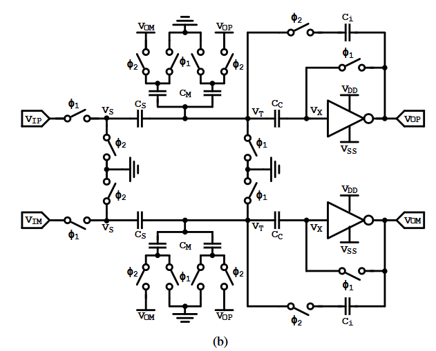

# Switched-Capacitor Integrator

*Block of the Delta-Sigma Modulator — Chipathon 2026.*

## 1. Block Overview

This block represents a fully differential switched-capacitor integrator based on a pseudo-differential Ring Amplifier. The integrator contains sampling capacitors, integration capacitors, clock-controlled switches and the RingAmp differential stage described in the lower levels of hierarchy.

Integration of the input signal is done by sampling and transferring the resulting charge to the integration capacitors. Repeating the process of charge accumulation several times, the circuit realizes the necessary discrete-time integration required for the operation of the delta-sigma modulator.

## 2. Function of the Integrator in the Delta-Sigma Modulator

The integrator is a building block of a delta-sigma modulator. Its role is the accumulation of the quantization error produced in the modulator's feedback path. In this way, the noise shaping occurs and part of the quantization noise is shifted out of the signal band.

Integration of signals in a switched-capacitor realization is realized by means of charge transfer between capacitors in the series of clock cycles. The charge transferred to the integration capacitors is proportional to the sampled value of the input signal. Thus, the realization of a discrete-time integrator is achieved which transfer function mainly depends on capacitor ratios.

The advantage of the fully differential circuit is its higher immunity to common-mode disturbances, reduced even-order distortions and increased signal range. At the same time, the implementation of the integrator based on the RingAmp differential stage allows performing the necessary amplification for the charge conservation in the integration nodes in the low-voltage region.

The accuracy of the integrator influences the performance of the delta-sigma modulator. Limited amplification gain, incomplete settling, capacitor mismatch and switches' nonidealities can cause integration errors that spoil the noise shaping and decrease SNDR.

## 3. Short Analysis



*Figure 1. Schematic of the integrator.*

The operation of the integrator involves two non-overlapping clock cycles. During the sampling cycle, the input voltage is charged onto the sampling capacitors. In the amplification cycle, the charge is transferred to the integration capacitors through the action of the RingAmp differential stage.

The analysis of the circuit can be performed based on the principle of charge conservation. Denote (Q_i) the total charge accumulated at the end of the sampling cycle and (Q_f) the charge accumulated at the end of the integration cycle. Then the principle of charge conservation implies

```math
Q_i = Q_f.
```

Taking into account the charge accumulated in the sampling capacitor (C_S), the compensation capacitor (C_C) and the integration capacitor (C_I), the charge balance is

```math
V_{IN}C_S + V_{OFF}C_C + Q_{C_I}(n-1)
=
V_{OFF}C_C + V_{OUT}(n)C_I.
```

The charge accumulated on the integration capacitor in the previous clock cycle is

```math
Q_{C_I}(n-1)
=
V_{OUT}(n-1)C_I.
```

Substituting this value into the charge balance equation, we get

```math
V_{OUT}(n)
=
V_{OUT}(n-1)
+
\frac{C_S}{C_I}V_{IN}(n).
```

Thus, the value of the output voltage at the current clock cycle depends on the new sample of the input voltage and the value of the output voltage in the previous cycle. Hence, the circuit accumulates charge, providing the necessary discrete-time integration.

The corresponding transfer function is

```math
H(z)
=
\frac{V_{OUT}(z)}{V_{IN}(z)}
=
\frac{p}{1-z^{-1}},
```

where (p=C_S/C_I) is the gain of the integrator. The pole at (z=1) characterizes an ideal discrete-time integrator and demonstrates the memory behavior required for quantization noise shaping in delta-sigma modulation.

However, in practice the finite gain of the amplifier, incomplete settling, capacitor mismatch and switch nonidealities may affect this ideal operation. Therefore, sufficient gain of the RingAmp and the exact capacitor ratios should be ensured in order to provide the required transfer function.

## 4. Specifications

The following specifications are preliminary design targets intended to guide the initial development of the switched-capacitor integrator. These values may be refined as system-level requirements for the delta-sigma modulator become available.

| Spec                      | Comment                                 | Target min | Target typ | Target max | Sch min | Sch typ | Sch max | Layout min | Layout typ | Layout max |
| ------------------------- | --------------------------------------- | ---------- | ---------- | ---------- | ------- | ------- | ------- | ---------- | ---------- | ---------- |
| V_DD                      | Supply voltage (±10%)                   | 1.35 V     | 1.50 V     | 1.65 V     | –       | –       | –       | –          | –          | –          |
| f_clk                     | Modulator clock frequency               | 4 MHz      | 4.5 MHz    | 5 MHz      | –       | –       | –       | –          | –          | –          |
| C_L                       | Load Capaciance                         | –          | TBD        | –          | –       | –       | –       |      –          | –          | –          |
| Settling Time             | Amplification phase settling            | –          | –          | 50 ns      | –       | –       | –       | –          | –          | –          |
| Differential Output Swing | Available output signal range           | TBD        | –          | –          | –       | –       | –       | –          | –          | –          |
| Integration Error                | Due to finite amplifier gain and other effects           | –          | –         | TBD        | –       | –       | –       | –          | –          | –          |
| Average Power             | Integrator contribution to power budget | –          | TBD        | –          | –       | –       | –       | –          | –          | –          |

## References

[1] A. J. Mantilla Rios, D. F. Gómez Serrano, and L. E. Rueda Guerrero, *Power Reduction Techniques for Low-Voltage Delta-Sigma Modulators*, Universidad Industrial de Santander, Bucaramanga, Colombia, 2023.
