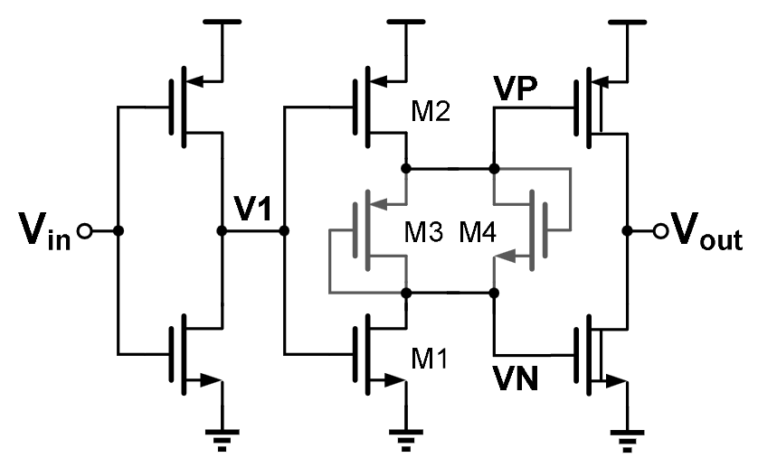

# RingAmp 

*Block of the Delta-Sigma Modulator — Chipathon 2026.*

## 1. Overview

This block implements a ring amplifier (RingAmp). The circuit consists of three cascaded inverter stages that provide large-signal amplification while maintaining low power consumption and compatibility with scaled CMOS technologies.

A dead-zone voltage generation is added into the second stage using diode-connected MOS transistors connected in antiparallel. This helps the circuit achieve a more stable stable closed-loop operation ans improves its settling behaviour.

## 2. Role in the Delta-Sigma Modulator

The ring amplifier in the current cell acts as the amplification element of a pseudo differential RingAmp block used within the switched-capacitor integrators of the delta-sigma modulator. 

Within the integrator, the RingAmp takes the place of a conventional operational amplifier and provides the gain required to move charges between capacitors during the integration phase. The inverter-based architecture enables large output swin high gain and scalability under low supply-voltage operation.

The dead-zone regultates the transition between slewing and settling, thus helping it achieve stability whn used in a feedback loop. By introducing a controlled voltage offset between the voltages at the input of the third inverter stage, the circuit reduces the regenerative action. Once the voltage difference produced by the previous stages becomes smaller than the dead-zone, the third stage provides little or no drive current, allowing the output to settle without excessive overshoot or oscillation. 

## 3. Short Analysis



*Figure 1. Proposed Ring Amplifier.*

The ring amplifier consists of three cascaded inverter stages. In case of the closed-loop usage, an input error propagates through the inverter chain, and each inverter stage amplifies the error. Due to the fact that the inverter stages are implemented as CMOS inverters with biasing close to the switching threshold, these stages have high transconductance while being suitable for low-voltage application.

For large output errors, the inverter chain acts as the highly regenerative system. First two inverter stages drive the output stage gates fastly and produce large charging and discharging currents that bring the output stage fast towards its target value. It makes it possible to slew the output very quickly at the beginning of the settling process.

However, when the output is approaching its final value, too much regeneration leads to overshoot and oscillations of the output. To decrease this effect, a dead-zone generation network is included into the scheme between second and third stages. Dead-zone network provides a voltage offset for PMOS and NMOS devices of the output stage. As soon as the voltage difference between control signals of output stage produced by two previous stages drops below this offset value, the current flowing in the output stage becomes smaller, and the regenerative effect of the amplifier becomes weaker.

The preliminary small-signal analysis of the scheme can be conducted using the equivalent transconductance and output resistance of the inverter stages. The dead-zone network produces the equivalent resistance

```math
R_{DZ}
=
r_{on,DZ}
\parallel
r_{op,DZ}
\parallel
\frac{1}{g_{mn,DZ}}
\parallel
\frac{1}{g_{mp,DZ}}
```

The voltage gain of the first inverter stage can be estimated as

```math
A_{S1}
=
-(g_{mn1}+g_{mp1})
(r_{on1}\parallel r_{op1})
```

The second inverter stage gain is described by the expression

```math
A_{S2}
=
\frac{
r_{op2}r_{on2}(g_{mp2}+g_{mn2})
+
R_{DZ}(g_{mp2}r_{op2}+g_{mn2}r_{on2})
}
{
r_{op2}+R_{DZ}+r_{on2}
}
```

and the gain of the third stage is

```math
A_{S3}
=
(g_{mn3}+g_{mp3})
(r_{on3}\parallel r_{op3})
```

Thus, the low-frequency gain of the whole amplifier is

```math
A_0 = A_{S1}A_{S2}A_{S3}
```

From these formulas it follows that the amplifier gain depends directly on the transconductance and output resistance of inverter stages, while the influence of the dead-zone network is made through the second stage gain. Therefore, both transistor dimensions and dead-zone implementation should be tuned together to provide enough amplifier gain while maintaining the required settling behaviour.

Dead-zone generator network includes anti-parallel connected diodes of NMOS and PMOS devices. In contrast to dead-zone networks implemented using constant resistances, such implementation makes the generated dead-zone voltage vary with technological processes and supply voltage changes. Thus, the connection between amplifier gain and dead-zone value can be preserved more precisely.

## 4. Specifications

The following specifications are preliminary design targets intended to guide the initial development of the RingAmp cell. These values may be refined as system-level requirements for the integrator and delta-sigma modulator become available.

| Spec | Comment | Target min | Target typ | Target max | Sch min | Sch typ | Sch max | Layout min | Layout typ | Layout max |
|---|---|---|---|---|---|---|---|---|---|---|
| V_DD | Supply voltage (±10%) | 1.35 V | 1.50 V | 1.65 V | – | – | – | – | – | – |
| f_clk | Modulator clock frequency | – | – | 5 MHz | – | – | – | – | – | – |
| C_L | Load Capaciance | – | TBD | – | – | – | – | – | – | – |
| DC Gain | Open-loop low-frequency gain | – | 70 dB | – | – | – | – | – | – | – |
| Output Swing | Operating output range | 0.6*VDD | – | – | – | – | – | – | – | – |
| Average Power | RingAmp contribution to power budget | – | TBD | – | – | – | – | – | – | – |

## References

[1] Y. Zhao et al., "A PVT-Insensitive Ring Amplifier With Deadzone Generation Based on Weak Inversion MOS Devices," IEEE Transactions on Circuits and Systems II: Express Briefs, vol. 70, no. 7, pp. 2514–2518, Jul. 2023.

[2] A. J. Mantilla Rios, D. F. Gómez Serrano, and L. E. Rueda Guerrero, "Power Reduction Techniques for Low-Voltage Delta-Sigma Modulators," Universidad Industrial de Santander, Bucaramanga, Colombia, 2023.

