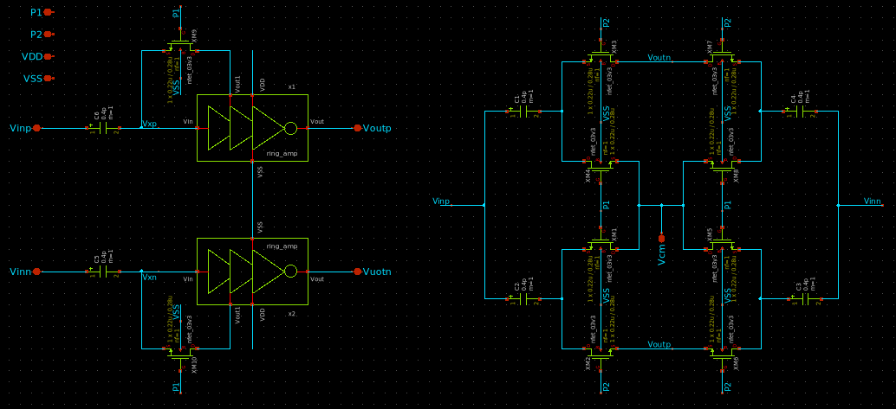

# RingAmp Differential

*Block of the Delta-Sigma Modulator — Chipathon 2026.*

## 1. Overview

This block implements a pseudo-differential Ring Amplifier based on two RingAmp cores. In addition to the amplification stages, the circuit incorporates common-mode feedback (CMFB) and auto-zero circuitry required for operation within the switched-capacitor integrator.

The differential architecture allows the amplifier to process complementary signal paths while the auxiliary circuits regulate the output common-mode level and reduce the impact of offset-related errors.

## 2. Role in the Delta-Sigma Modulator

This block serves as the active amplification element of the switched-capacitor integrator used within the delta-sigma modulator. The pseudo-differential architecture enables the processing of differential signals, which improves immunity to common-mode disturbances and increases the available signal swing compared to a single-ended implementation.

The common-mode feedback circuitry maintains the output common-mode voltage within the desired operating range. Without this mechanism, the two output nodes could drift over successive operating cycles, eventually degrading the integrator performance or driving the amplifier outside its intended operating region.

The auto-zero circuitry is used to sample and compensate offset-related errors before the amplification phase. By reducing the effect of amplifier offset, the integrator can achieve improved accuracy and reduced error accumulation during delta-sigma modulation.

## 3. Short Analysis



*Figure 1. Pseudo-differential RingAmp schematic.*

The pseudo-differential amplifier is formed by two RingAmp cores operating on complementary signal paths. The differential output signal is defined as

```math
V_{OD}=V_{OP}-V_{ON}
```

while the output common-mode voltage is

```math
V_{CM}=\frac{V_{OP}+V_{ON}}{2}.
```

The RingAmp cores determine the differential gain of the amplifier, whereas the CMFB network regulates the common-mode component. This separation allows the circuit to amplify differential signals while maintaining a controlled operating point for both output nodes.

During the auto-zero phase, the offset of the amplification path is sampled onto dedicated capacitors. During the amplification phase, the stored charge acts to compensate the sampled offset, reducing its contribution to the output error. As a result, the pseudo-differential RingAmp provides improved accuracy compared to an uncompensated implementation while preserving the advantages of the underlying RingAmp architecture.

## 1. Overview

In this block, a pseudo-differential Ring Amp is realized using two RingAmp blocks. Alongside with this, there are CMFB (common-mode feedback) and auto-zero circuits that are necessary for the correct functioning in the switched-capacitor integrator environment as they are responsible for controlling the output common-mode voltage and reducing offset-related error impact on the output respectively. Additionally, using a differential configuration allows the amplifier to process complementary signal paths.

## 2. Usage in the Delta-Sigma Modulator

This block plays the role of the active amplification element for the switched-capacitor integrator that is used inside the delta-sigma modulator. Using the pseudo-differential configuration of the amplifier makes possible to process differential signals. Such design makes the amplifier less sensitive to the common-mode disturbances and enlarges the available signal range comparing to the single-ended solution.

The common-mode feedback circuits maintain the output common-mode voltage inside the desired range. Otherwise, the voltages of the two output nodes could drift over time between different operating cycles leading to the deteriorated performance of the integrator or even driving the amplifier beyond its intended operation region.

Auto-zero part of the circuit is used for sampling and compensating offset-related errors before the amplifying stage. Reducing the offset influence on the amplifier makes possible to reach better accuracy and reduce the error accumulation effect during delta-sigma modulation.

## 3. Short Analysis


*Figure 1. Schematic of pseudo-differential RingAmp.*

Pseudo-differential amplifier is formed using two RingAmp cores working on complementary signal paths. The output differential signal equals

```math
V_{OD}=V_{OP}-V_{ON},
```

and the output common-mode voltage equals

```math
V_{CM}=\frac{V_{OP}+V_{ON}}{2}.
```

RingAmp cores provide the differential gain of the amplifier. The CMFB circuit controls the output common-mode voltage. That makes possible to amplify differential signals and control the operating point of both output nodes at the same time.

During the auto-zero phase, the offset of the amplification path is sampled onto special capacitors. During the amplification phase, the stored charge acts to compensate the sampled offset reducing its effect on the output error. Thus, this pseudo-differential RingAmp provides improved accuracy comparing to the uncompensated one.

## 4. Specifications

The following specifications are preliminary design targets intended to guide the initial development of the pseudo-differential RingAmp. These values may be refined as system-level requirements for the integrator and delta-sigma modulator become available.

| Spec                       | Comment                                | Target min | Target typ | Target max | Sch min | Sch typ | Sch max | Layout min | Layout typ | Layout max |
| -------------------------- | -------------------------------------- | ---------- | ---------- | ---------- | ------- | ------- | ------- | ---------- | ---------- | ---------- |
| V_DD                       | Supply voltage (±10%)                  | 1.35 V     | 1.50 V     | 1.65 V     | –       | –       | –       | –          | –          | –          |
| f_clk                      | Modulator clock frequency              | 4 MHz      | 4.5 MHz    | 5 MHz      | –       | –       | –       | –          | –          | –          |
| Differential DC Gain       | Low-frequency differential gain        | 40 dB      | 50 dB      | –          | –       | –       | –       | –          | –          | –          |
| Output Common-Mode Voltage | Regulated by CMFB                      | –          | 0.75 V     | –          | –       | –       | –       | –          | –          | –          |
| Differential Output Swing  | Available signal range                 | TBD        | TBD        | TBD        | –       | –       | –       | –          | –          | –          |
| Input-Referred Offset      | After auto-zero operation              | TBD        | TBD        | TBD        | –       | –       | –       | –          | –          | –          |
| Average Power              | Amplifier contribution to power budget | –          | TBD        | –          | –       | –       | –       | –          | –          | –          |

## References

[1] A. J. Mantilla Rios, D. F. Gómez Serrano, and L. E. Rueda Guerrero, *Power Reduction Techniques for Low-Voltage Delta-Sigma Modulators*, Universidad Industrial de Santander, Bucaramanga, Colombia, 2023.
